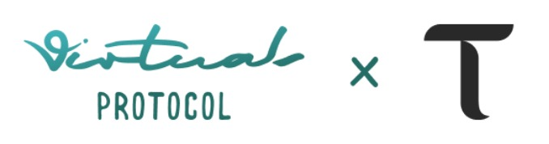
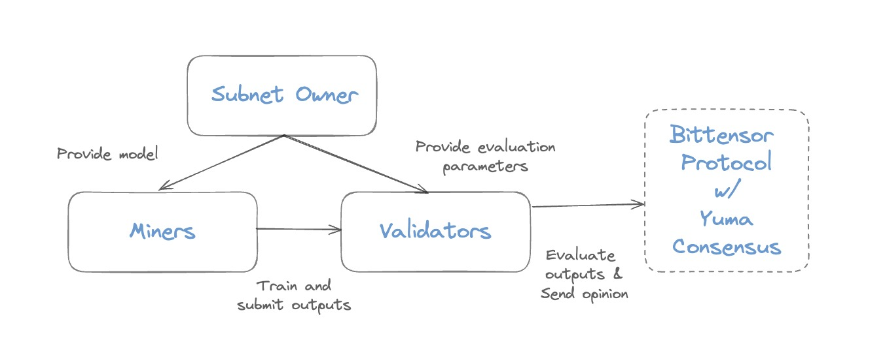

<div align="center">
</img>
</div>


# Virtuals Protocol's Audio-to-Animation (A2A) Bittensor Subnet

*News: The A2A Bittensor Subnet is now on the mainchain with UID 25! Please join the [Bittensor Discord](https://discord.gg/RXST8svz) and see us at Channel א·alef·25! Please also check our [X](https://twitter.com/virtuals_io/status/1785345062311960843) for our vision of creating an avenue where everyone can contribute to creating the best open-source A2A models.  4th May 2024*

> **Note:** For more details around Virtuals Protocol's Audio-to-Animation (A2A) Bittensor Subnet, please feel free to check out our [whitepaper](https://whitepaper.virtuals.io/audio-to-animation-bittensor-subnet).

---
- [Introduction](#introduction)
  - [Roadmap](#roadmap)
  - [Status](#status)
- [Mechanism](#mechanism)
  - [Evaluation Protocol](#evaluation-protocol)  
- [Getting Started](#getting-started)
  - [Validator](#validator)
  - [Miner](#miner)
- [Acknowledgements](#acknowledgements)
- [License](#license)
---

## Introduction
Audio-to-Animation (A2A), also referred to as audio-driven animation, generates visuals that dynamically respond to audio inputs. This technology finds applications across a wide range of domains including gaming AI agents, livestreaming AI idols, virtual companions, metaverses, and more.

This Bittensor subnet offers a platform for democratizing the creation of A2A models, gathering the help of the wider ML community in Bittensor to generate the best animated motions and bring life to on-chain AI agents.

### Roadmap
We will divide the development of A2A models into several phases, with an iterative approach to make it better over time.

- **Phase 1**: Focus on generating full body motions, such as dance movements, based on the audio input from a specific curated dataset.
- **Phase 2**: Recognise the mood and genre of the audio input and adjust the generated animation accordingly.
- **Phase 3**: Widen models capabilities beyond dance audio and motions to general animation motions (i.e. gestures etc.).
- **Phase 4**: Expand A2A model into Audio-to-Video network in order to enhance visual experiences.

### Status
Currently, we're at Phase 1, where audio-to-dance motions will be the focus. Validators will choose a prompt from the reference library and send the prompt to miners for generation of animation outputs.

## Mechanism

1. **Subnet owner:** Virtuals Protocol as the subnet owner, creates the modules for miners and validators to train and evaluate the generated animation. Subnet Owner also decides on the parameters involved in evaluating the animation’s performance. 
2. **Miners:** Generate animations with A2A models using reference models or other models.
3. **Validators:** Provide audio prompts to miners and evaluate the submitted animation from miners based on the parameters suggested by the subnet owner. 
4. **Bittensor protocol:** Aggregate weights using Yuma Consensus and determine the final weights and allocation ratios for each miner and validator.

### Evaluation Protocol
Given the non-determinism of an animation output, an evaluation mechanism which considers multiple parameters will be implemented in a phased approach. Read up more about the evaluation mechanism under [Validator documentation](./docs/validator.md) and in the [whitepaper](https://whitepaper.virtuals.io/audio-to-animation-bittensor-subnet). 

## Getting Started

### Validator
See [Validator documentation and guide](./docs/validator.md).

### Miner
See [Miner documentation and guide](./docs/miner.md).

## Acknowledgements
Reference A2A models and implementations are from open-source projects [EDGE](https://github.com/Stanford-TML/EDGE/tree/main) and [DiffuseStyleGesture](https://github.com/YoungSeng/DiffuseStyleGesture).

## License
This repository is licensed under the MIT License.
```text
# The MIT License (MIT)
# Copyright © 2023 Yuma Rao

# Permission is hereby granted, free of charge, to any person obtaining a copy of this software and associated
# documentation files (the “Software”), to deal in the Software without restriction, including without limitation
# the rights to use, copy, modify, merge, publish, distribute, sublicense, and/or sell copies of the Software,
# and to permit persons to whom the Software is furnished to do so, subject to the following conditions:

# The above copyright notice and this permission notice shall be included in all copies or substantial portions of
# the Software.

# THE SOFTWARE IS PROVIDED “AS IS”, WITHOUT WARRANTY OF ANY KIND, EXPRESS OR IMPLIED, INCLUDING BUT NOT LIMITED TO
# THE WARRANTIES OF MERCHANTABILITY, FITNESS FOR A PARTICULAR PURPOSE AND NONINFRINGEMENT. IN NO EVENT SHALL
# THE AUTHORS OR COPYRIGHT HOLDERS BE LIABLE FOR ANY CLAIM, DAMAGES OR OTHER LIABILITY, WHETHER IN AN ACTION
# OF CONTRACT, TORT OR OTHERWISE, ARISING FROM, OUT OF OR IN CONNECTION WITH THE SOFTWARE OR THE USE OR OTHER
# DEALINGS IN THE SOFTWARE.
```
